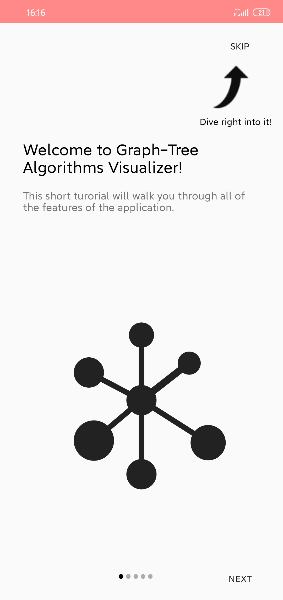
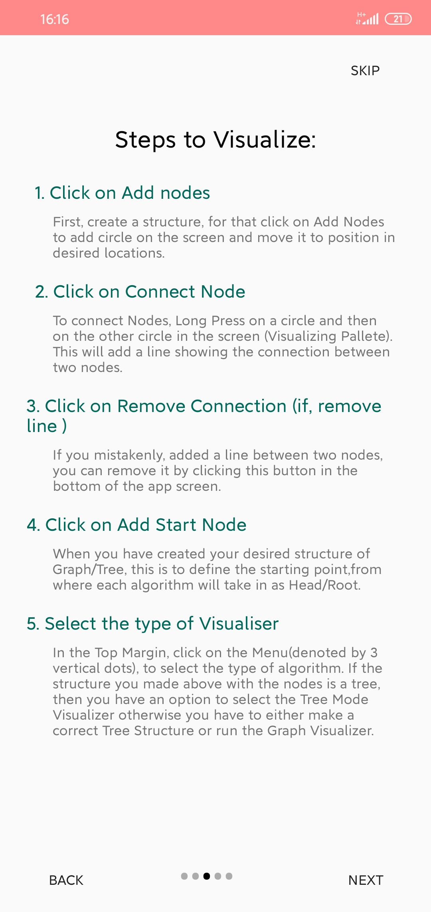
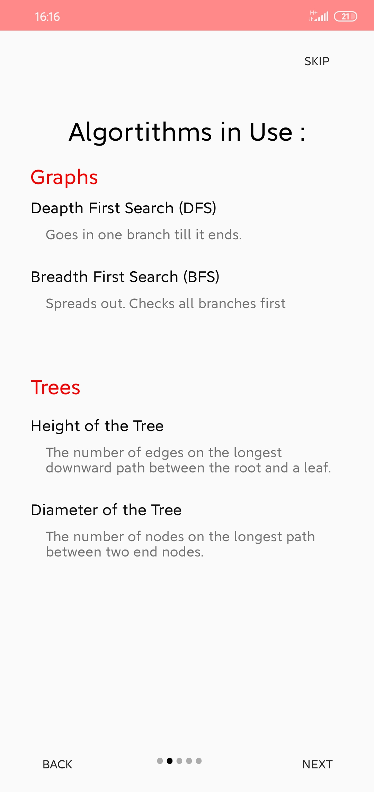
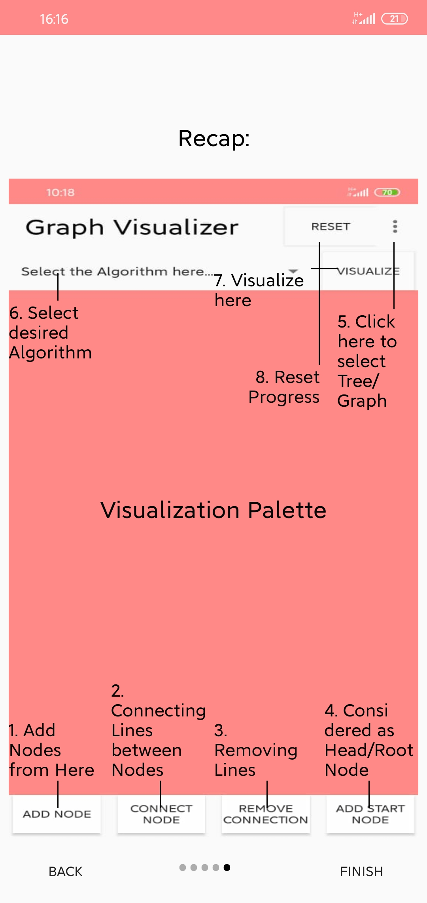

# Graph-visualiser :eye_speech_bubble:
:smile: Welcome to Graph-Visualizer android app to visualize various graph/tree algorithms!! </br>

## Sneak Peak towards our creation:

<kbd>  </kbd>

----

## All about Graph-Visualizer
- It helps in visualising various graph and tree algorithms.
- A Tutorial Sheet has been attached at the beginning for basic understanding.
- It works on various algorithms like DFS, BFS, Height of Tree and Diameter of the Tree.
- User can test the model by visualising all the algorithms working all together in a single application.
- It will help in better understanding of Graph Datastructure.
- It shows one of the most used application of Graph in real life.


## DFS Algorithm
- Depth-first search is an algorithm for traversing or searching tree or graph data structures. The algorithm starts at the root node and explores as far as possible along each branch before backtracking

## BFS Algorithm
- Breadth-first search is an algorithm for traversing or searching tree or graph data structures. It starts at the tree root, and explores all of the neighbor nodes at the present depth prior to moving on to the nodes at the next depth level.

## Height of the Tree
- The height of a node is the number of edges from the node to the deepest leaf. The height of a tree is a height of the root. A full binary tree.is a binary tree in which each node has exactly zero or two children.

## Diameter of the Tree
- The diameter of a tree (sometimes called the width) is the number of nodes on the longest path between two end nodes.

## TUTORIAL-SHEET DISPLAY  :eyes:	
<kbd></kbd>
<kbd></kbd>
<kbd></kbd>
<kbd></kbd>

## Getting Started :+1:

These instructions will get you a copy of the project up and running on your local machine for development and testing purposes. See deployment for notes on how to deploy the project on a live system.

### Prerequisites

What things you need to install the software and how to install them

```
Things you need to install this mobile aplication->
1. Android Mobile
That's it!
```

### Installing

A step by step series of examples that tell you how to get a development env running

Say what the step will be

```
You can Download the application using below link-
https://github.com/The-Lazy-People/Graph-Visualiser.git
```

## Built With :heartbeat:

* Android Studio
* Kotlin

## Contributing

All kinds of contribution :heart_eyes: are welcomed.
- <a href="https://github.com/The-Lazy-People/Graph-Visualiser/pulls"> Make a Pull request </a>
- <a href="https://github.com/The-Lazy-People/Graph-Visualiser/issues"> Open Issue </a>

## Authors

* <a href="https://www.linkedin.com/in/abhishek-yadav-aps/"> **Abhishek Yadav** </a> 
* <a href="https://www.linkedin.com/in/2001adarshsingh/"> **Adarsh Singh** </a> 
* <a href="https://www.linkedin.com/in/ayushi-doshi-731210191/">  **Ayushi Doshi** </a>

